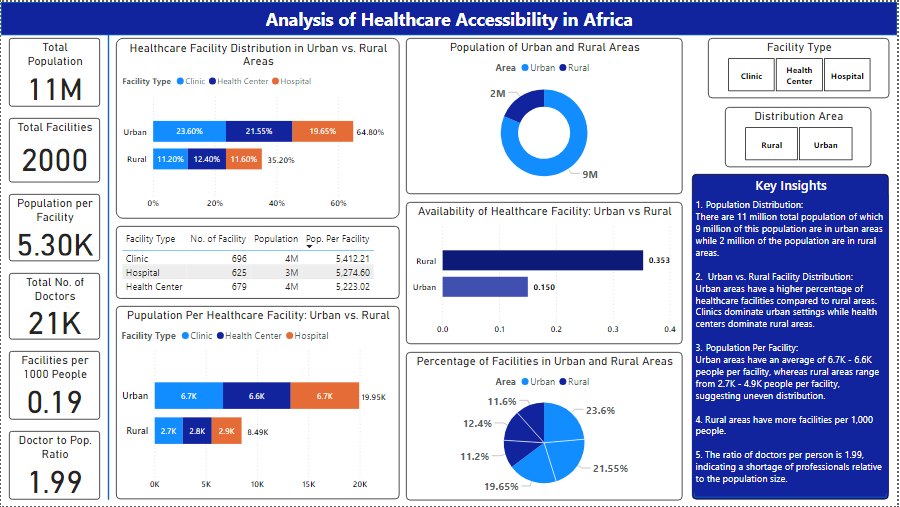

# Dr_Mike_Project_Portfolio

## About Me

Hello! I'm Dr. Michael Chibuike Mgbeokwere, a dental surgeon and data analyst passionate about turning data into actionable insights. I specialize in Excel, Power BI, Tableau, and SQL using Microsoft SQL Server, with experience in data entery, data cleaning and transformation, analysis, visualization, database management, communication and presentation. My goal is to help organizations across various sectors such as business, healthcare, education and government make data-driven decisions through clear and impactful analysis.

## Skills
- *Microsoft Excel*: Data cleaning and preparation, Descriptive statistics, Formulas and functions, Pivot tables and pivot charts, Data visualization, Dashboard creation, Power query (ETL), Power Pivot and data modeling, and VBA for automation
- *Power BI*: Data connection and import, Data cleaning and transformation with Power Query, Data modeling, DAX, Time intelligence, Data visualization, Interactive dashboards and reports, and Row-Level security
- *Tableau*: Data Connection and import, Data preparation, Data modeling, Calculated fields and table calculations, Time series and Date functions, Data visualization, Interactive dashboards, and Storytelling with data
- *SQL*: Data retrieval, Sorting and limiting results, Joins and reltionships, Aggregations and grouping, Subqueries and nested queries,  window functions, Data cleaning and preparation, Table management and schema understanding, Common table expressions, Complex queries, and database optimization

## Projects

### 1. Analysis of Healthcare Accessibility in Africa (Power BI)
- *Description*: Built an interactive dashboard to analyze healthcare facility data across African Nations, to unravel the challenges of healthcare acceessibility. The aim is to identify disparities in access to healthcare between urban and rural areas and evaluate the efficiency of healthcare funding. Insight generated was used to propose data-driven recommendations that government and stakeholders can implement to enhance healthcare service delivery across Africa.
- *Tools*: Power BI
- *Files*: [Download .pdf File](projects/Healthcare-Accessibility-in-Africa-File.pdf)
- *Screenshot*: 

## Certificates

### Cisco Networking Academy

- *Data Analytics Essentials* - [View Certificate](certificates/Cisco-Data-Analytics-Essentials-Certificate.pdf)
- *Introduction to Data Science* - [View Certificate](certificates/Cisco-introduction-to-data-science-certificate.pdf)

### Foresight BI
 
- *Data Visualization Essentials* - [View Certificate](certificates/Foresight-BI-Data-visualization-essentials.pdf)
- *Microsoft Excel Basics* - [View Certificate](certificates/Foresight-BI-Excel-certificate.pdf)

### Great Learning 

- *Data Visualization with Power BI* - [View Certificate](certificates/GL-Data-visualization-Certificate.pdf)
- *Excel for Beginners* - [View Certificate](certificates/GL-Excel-for-beginners-certificate.pdf)
- *Pivot Table in Excel* - [View Certificate](certificates/Great-learning-certificate-Pivot-table.pdf)
- *Excel Tips and Tricks* - [View Certificate](certificates/Great-learning-certificate-on-Excel-Tips.pdf)

### HP LIFE (HP Foundation)

- *Data Science and Analytics* - [View Certificate](certificates/Hp-life-certificate-on-data-science-and-analytics.pdf)

### Skillup by Simplilearn

- *Power BI Data Modelling Basics* - *(Microsoft-endorsed)* [View Certificate](certificates/Simplelearn-Certificate-POWERBI-Data-Modelling-Basics.pdf)
- *Power BI for Beginners* - [View Certificate](certificates/Simplelearn-Certificate-POWERBI-for-Beginners.pdf)
- *SQL for Data Analysis* - [View Certificate](certificates/Simplilearn-Certificate-SQL-for-Data-Analysis.pdf)
- *Introduction to Power Query in Excel* - [View Certificate](certificates/Simplelearn-certificate-on-power-query.pdf)

### Udemy

- *Business Analyst Career Path: 22 Days BI Analytics Bootcamp* - [View Certificate](certificates/Udemy-Business-Analyst-Career-Path-Using-Excel-and-PowerBI.pdf)
- *Data Analysis | SQL, Tableau, Power BI, Excel, | Real Projects* - [View Certificate](certificates/Udemy-Certificate-on-Data-Analysis-with-Tableau-PowerBI-Excel-and-SQL.pdf)
- *Statistics for Data Science and Business Analysis* - *(instructors: 365 Careers)* [View Certificate](certificates/Udemy-statistics-for-data-science-certificate.pdf)
- *SQL with SQL Server Management Studio (SSMS)* - [View Certificate](certificate/Udemy-SQL-with-SQL-Server-Management-Studio-(SSMS).pdf)

## Contact
- *Email*: mgbeokwerec@gmail.com
- *LinkedIn*: https://www.linkedin.com/in/dr-chibuike-mgbeokwere-561584218
- *GitHub*: https://github.com/ChibuikeMichael

Feel free to reach out for collaboration or job opportunities!

---
Last updated: April 2025
